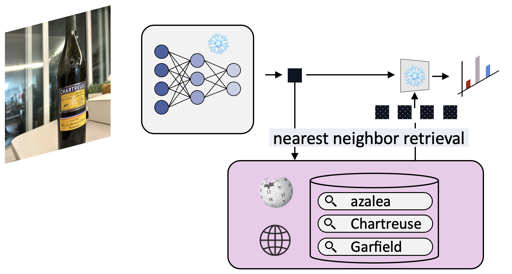

<div align="center">
  <h1> Memory-Modular Classification: Learning to Generalize with Memory Replacement </h1>
</div>


<div align="center">
  <h3><a href=http://dahyun-kang.github.io>Dahyun Kang</a> &nbsp;&nbsp;&nbsp;&nbsp; <a href=https://scholar.google.com/citations?user=wIjyqzAAAAAJ&hl=en&oi=ao>Ahmet Iscen</a> &nbsp;&nbsp;&nbsp;&nbsp;  Eunchan Jo &nbsp;&nbsp;&nbsp;&nbsp;  <a href=https://sua-choi.github.io/>Sua Choi</a>  &nbsp;&nbsp;&nbsp;&nbsp; <a href=http://cvlab.postech.ac.kr/~mcho/>Minsu Cho</a> &nbsp;&nbsp;&nbsp;&nbsp;   <a href=https://scholar.google.com/citations?user=IvqCXP4AAAAJ&hl=en>Cordelia Schmid</a></h3>
</div>
<br />


<div align="center">
  <a href="https://arxiv.org/abs/2504.06021"></a>
</div>
<br />

<div align="center">
  
</div>

This repo is the official implementation of the TMLR 2025 paper [Memory-Modular Classification: Learning to Generalize with Memory Replacement](https://openreview.net/forum?id=DcIW0idrg8&)


## Conda installation command
```bash
conda env create -f environment.yml --prefix $YOURPREFIX
```
`$YOUPREFIX` is typically `/home/anaconda3`

## Training command
```python
python main.py \
    --datapath $YOURDATASETPATH \
    --dataset {imagenetunseen/cub200} \
    --logpath $YOURLOGPATH
```

## Eval command
```python
python main.py \
    --datapath $YOURDATASETPATH \
    --dataset {imagenetunseen/cub200} \
    --logpath $YOURLOGPATH
    --eval
```


### ImageNet100 data preparation

Download and extract ImageNet100 from [here](https://www.kaggle.com/datasets/ambityga/imagenet100).
Then download and extract the [wiki text](https://github.com/ChangyaoTian/VL-LTR/releases/download/text-corpus/imagenet.zip) into the same directory, and the directory tree of data is expected to be like this:

```
{your root path}/imagenet100/
  train.X1
  train.X2
  train.X3
  train.X4
  val.X
  wiki/
  	desc_1.txt
  labels.txt

```

## Flags
- Raise `--nowandb` for no wandb logging
- Raise `--eval` for evaluating the best checkpoint of the corresponding `--logpath` experiment
- Raise `--resume` for resume from the last checkpoint of the corresponding `--logpath` experiment
